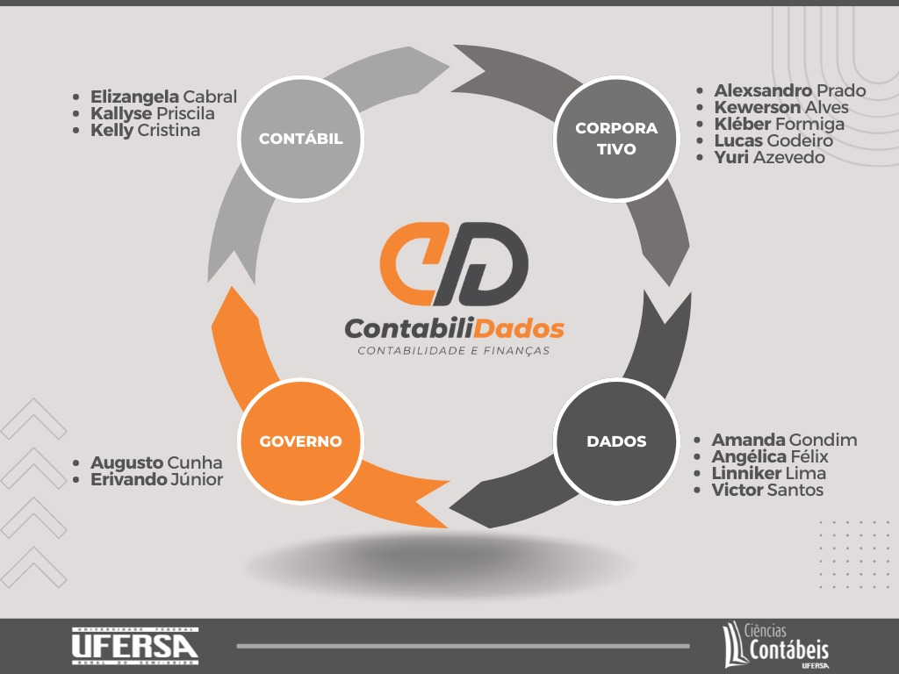

A equipe contabiliDados conta com professores e alunos dos cursos de Ciências
Contábeis, Ciências da Computação e Ciência e Tecnologia. O grupo se divide em
quatro eixos direcionadores de suas pesquisas: Contábil, Dados, Corporativo e Público.

----

## Pesquisadores

**Alexsandro Gonçalves da Silva Prado**
([lattes](http://lattes.cnpq.br/4254857944224293)):
Graduado em Ciências Contábeis. É Doutor em economia (UFPB) e mestre em Ciências
Contábeis. Atua no eixo `Corporativo` com análise de indicadores e modelos para
decisões no setor privado.

**Amanda Gondim de Oliveira**
([lattes](http://lattes.cnpq.br/3619642245221227)):
Graduada em Engenharia de Computação. Mestre em Ciência e Engenharia de Petróleo
(ênfase em Automação) e Doutora em Engenharia Elétrica e Computação. Atua no eixo
de `Dados` com análise descritiva e Machine Learning.

**Angélica Félix de Castro**
([lattes](http://lattes.cnpq.br/3724857575582110)):
Graduada em Ciência da Computação. Mestre e Doutora em Geodinâmica. Atua no eixo 
de `Dados` com gestão e análise de bancos de dados convencionais e não-convencionais.

**Antonio Erivando Xavier Junior**
([lattes](http://lattes.cnpq.br/0381960218530015)):
Graduado em Ciências Contábeis. Mestre em Ciências Contábeis e Doutor em
Administração. Atua no eixo `Governo` com análise de indicadores e modelos
para decisões no setor público.

**Augusto Cezar da Cunha e Silva Filho**
([lattes](http://lattes.cnpq.br/1674341274374869)):
Graduado, mestre e doutor em Ciências Contábeis. Atua no eixo `Governo` com
análise de indicadores e modelos para decisões no setor público.

**Elizangela Cabral dos Santos**
([lattes](http://lattes.cnpq.br/0404594071278199)):
Graduada e mestre em agronomia. Doutora em Fitotecnia. Atua no eixo `Contábil`
com desenvolvimento de estatísticas descritivas e emissão de relatórios de
dados contábeis.

**Kallyse Priscila Soares de Oliveira**
([lattes](http://lattes.cnpq.br/7770515192331111)):
Graduada, mestre e doutora em Ciências Contábeis. Atua no eixo `Contábil`
com desenvolvimento de práticas de ensino em contabilidade com uso de dados e
emissão de relatórios de dados contábeis.

**Kelly Cristina de Oliveira**
([lattes](http://lattes.cnpq.br/9096119384550930)):
Graduada em Ciências Contábeis. Mestre em Administração. Atua no eixo `Contábil`
com desenvolvimento de práticas de ensino em contabilidade com uso de dados e
emissão de relatórios de dados contábeis.

**Kléber Formiga Miranda**
([lattes](http://lattes.cnpq.br/5969359253746807)):
Graduado em Ciências Contábeis. Mestre em Administração e Controladoria e Doutor
em Ciências Contábeis. Atua no eixo `Corporativo` com análise de indicadores e
modelos para decisões no setor privado.

**Lucas Lucio Godeiro**
([lattes](http://lattes.cnpq.br/0903970970268664)):
Graduado, mestre e doutor em Economia. Atua no eixo `Corporativo` com análise
de indicadores e modelos para decisões no setor privado.

**Yuri Gomes Paiva Azevedo**
([lattes](http://lattes.cnpq.br/4060685200362433)):
Graduado e mestre em Ciências Contábeis. Doutor em Controladoria e Contabilidade.
Atua no eixo `Corporativo` com análise de indicadores e modelos para decisões
no setor privado.

## Alunos

**João Victor Leite dos Santos**
([lattes](http://lattes.cnpq.br/9117722681610515)):
Graduando em Ciências e Tecnologia. Atua no eixo `Dados` com coleta, tratamento
e busca de insight em dados.

**Kewerson Alves Cunha**
([lattes](http://lattes.cnpq.br/3158464950144943)):
Graduando em Ciências Contábeis. Atua no eixo `Corporativo` com coleta, tratamento
e busca de insight em dados.

**Linniker Ramon Leite Lima**
([lattes](http://lattes.cnpq.br/3276040869441738)):
Graduado em Ciência da Computação. Graduando em Ciências Contábeis. Atua no eixo
`Corporativo` com avaliação de scripts de coleta, tratamento e busca de insight
em dados.
